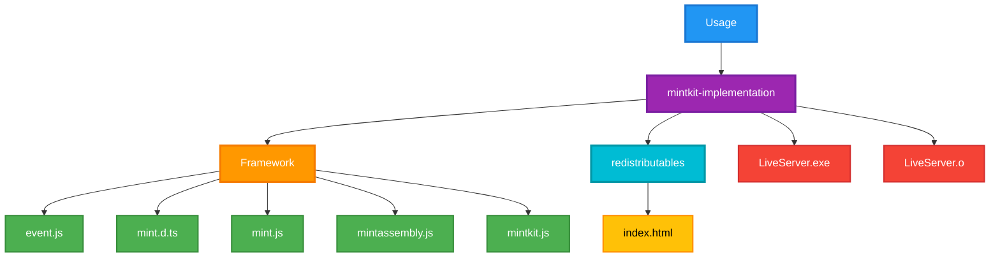

<p align="center">
  </img>
</p>

<h1 align="center">Mintkit</h1>

## About Mintkit

Mintkit is a moderate JavaScript framework that simplifies web development by combining dynamic content management features in a single, easy-to-use, intuitive tool with
a simplifies the website creation process while maintaining flexibility and performance, allowing you to focus on creating innovative web applications smoothly.

## Why Choose Mintkit?

Mintkit eliminates the need for multiple libraries and frameworks by providing everything you need in one cohesive package
Whether you are building a simple website or a complex web application, Mintkit can take action and make you happy to create with it.

## Additional documents

[Get Started with Mintkit framework](https://amaikoe.nekosakura.work/blog/en/getting-started-mintkit)

## Features

### State Management & Virtual DOM

- **Reactive State System**: Automatic re-rendering when state changes
- **Virtual DOM**: Efficient DOM diffing and patching
- **Component Architecture**: Modular and reusable components

### Design System

- **Typography**: Google Fonts integration with comprehensive font system
- **Spacing Scale**: Consistent spacing from 0-32rem
- **Theme System**: Automatic light/dark theme switching
- **Responsive Design**: Built-in breakpoint system
- **Animation**: Smooth transitions and keyframes

### Development Tools

- **Live Reload**: Hot reloading development server
- **MintAssembly**: HTML-based programming language
- **Electron Support**: Desktop application framework
- **Performance Monitoring**: Built-in performance tracking

## Get Started

### 1. Basic Setup

```html
<!-- index.html -->

<!DOCTYPE html>
<html lang="en">
  <head>
    <meta charset="UTF-8" />
    <meta name="viewport" content="width=device-width, initial-scale=1" />
    <title>Mintkit pure HTML</title>
    <link rel="dns-prefetch" href="//mint-teams.web.app" />
    <link rel="preconnect" href="https://mint-teams.web.app" crossorigin />
    <link
      rel="modulepreload"
      href="https://mint-teams.web.app/Mintkit/mint.js"
    />
  </head>
  <body>
    <div id="app"></div>

    <script type="module">
      import { Mint } from "https://mint-teams.web.app/Mintkit/mint.js";

      const app = `
            <h1>
                Hello, Mintkit!
            </h1>
        `;

      queueMicrotask(() => Mint.injectHTML("#app", app));
    </script>
  </body>
</html>
```

### 2. Add your page content

```PseudoCode
// Create your content file ex. Content.js
// Link your content file into Mintkit pages (index.html)
Javascript -> import { Content } from 'content.js';
```

```js
// content.js

export const Content = {
  components: `
      <!-- Enter html code here -->
      <button>Hello mintkit</button>
  `,
  stylesheet: `
      /*
          Enter your CSS code here
      */
  `,
};
```

Than you go back into Mintkit pages (index.html) and insert this code inside script tag

```js
import { Mint } from "https://mint-teams.web.app/Mintkit/mint.js";
import { Content } from "content.js";

const App = () => {
  const root = {
    html: Content.components,
    css: Content.stylesheet,
  };

  queueMicrotask(() => {
    Mint.injectHTML("#app", root.html);
  });
};

App();
```

### 3. include you css with Mintkit

```js
Mint.include("./redistributables/design/mint-uas.css");
```

## Build-in Features

### State Management

```javascript
const state = Mint.createState({ count: 0 });

// Update state
state.set((s) => ({ ...s, count: s.count + 1 }));

// Subscribe to changes
state.subscribe((newState) => {
  console.log("State updated:", newState);
});
```

### Theme System

```javascript
const lightTheme = {
  ColorPrimary: "#FFFFFF",
  TextColorPrimary: "#080707",
};

const darkTheme = {
  ColorPrimary: "#000000",
  TextColorPrimary: "#FFD9D9",
};

WebContent.initThemeSystem();
```

## Development

### Live Reload Server

```bash
cd mintkit
./LiveServer.exe
# Open http://localhost:3000
```

## Project Structure



## Contributing

We welcome all contributions to **Mintkit**! Here's how you can help to improve:

### How to Contribute

1. **Fork** this repository and clone it to your local machine.
2. **Create** a new branch for your changes.
3. **Make** your changes and write tests (if applicable).
4. **Ensure** that the code passes all tests and follows the project's style guidelines.
5. **Commit** your changes with clear, concise commit messages.
6. **Push** your changes and create a pull request with a detailed explanation.

### Contribution Guidelines

- **Code Style**: Follow the existing code style and conventions
- **Documentation**: Update documentation for any new features
- **Testing**: Add tests for new functionality
- **Performance**: Consider performance implications of changes
- **Compatibility**: Ensure changes work across different browsers

## Links

- **GitHub Repository**: https://github.com/Peakk2011/Mintkit
- **CDN**: https://cdn.jsdelivr.net/gh/Peakk2011/Mintkit@main/plugins/core/lib/mint.js

---

`npx create-mint-app` to create Mintkit project <br>

**Mintkit** - Making web development dynamic and more customizable way.

## License
This project is licensed under the MIT License go and see the [LICENSE](./LICENSE.md) file for details.
